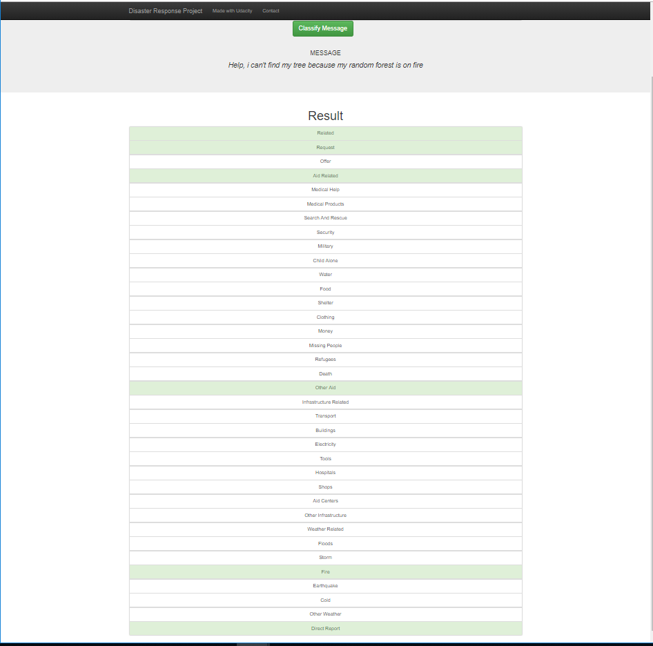
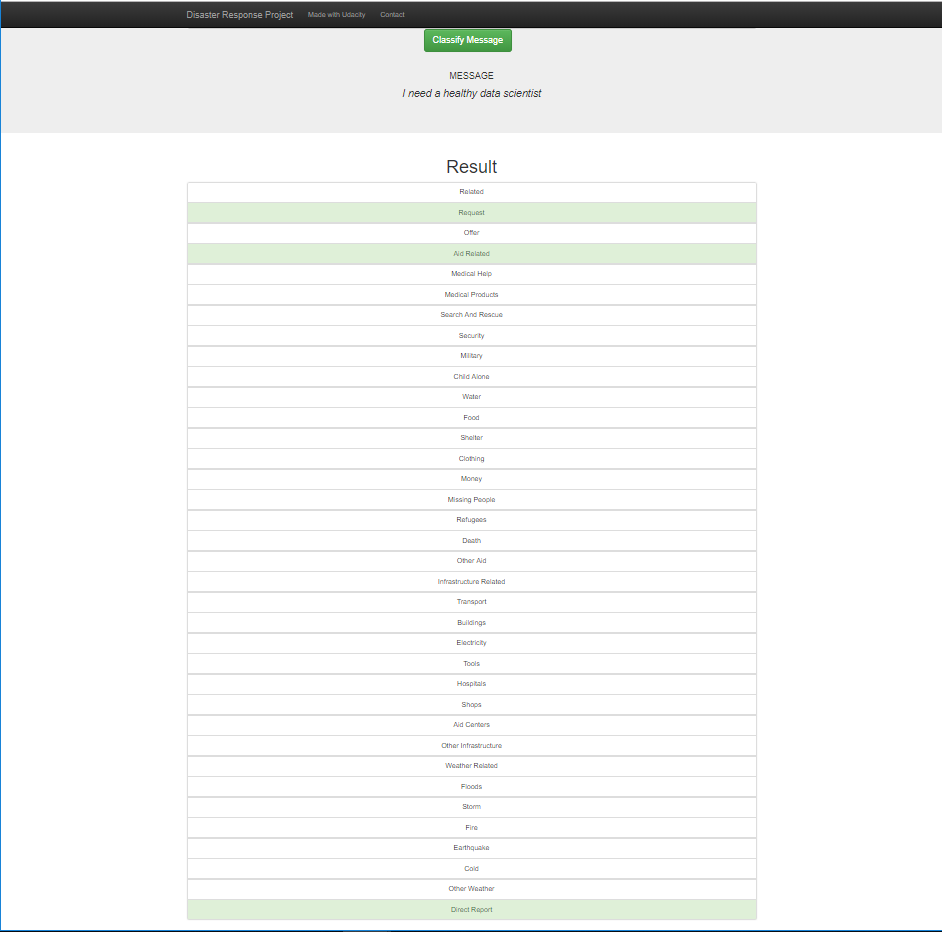
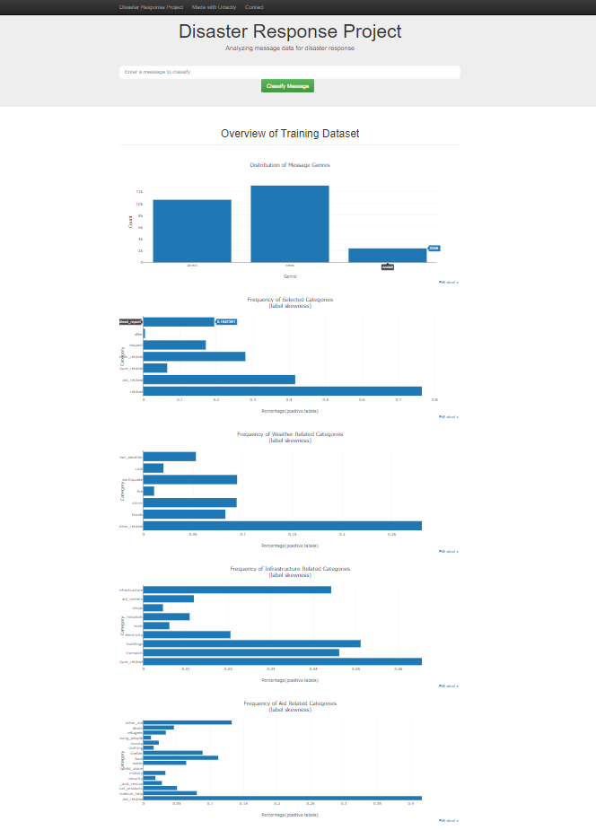

# Disaster Response Pipeline Project

### Instructions:
1. Run the following commands in the project's root directory to set up your database and model.

    - To run ETL pipeline that cleans data and stores in database
        `python data/process_data.py data/disaster_messages.csv data/disaster_categories.csv data/DisasterResponse.db`
    - To run ML pipeline that trains classifier and saves
        `python models/train_classifier.py datcda/DisasterResponse.db models/classifier.pkl`

2. Run the following command in the app's directory to run your web app.
    `python run.py`

3. Go to http://0.0.0.0:3001/

### Clips from the 'app':
The following clips illustrate the 'app' in use:

**Clip1:** Shows the classifications obtained when app score message: _"Help, I can't find my tree because my random forest is on fire"._

**Clip2:** Shows the classifications obtained when app score message _"I need healthy data scientist"._

**Clip3:** Visualisasions of project data.

### Project implementation:

#### Data Load and Cleaning(`process_data.py`)
Through python program `data/process_data.py` is datasets:
 - read from the two files `data/disaster_messages.csv` (messages) and `data/disaster_categories.csv`(labeled categories) and joined on common (message)**id**. 
 - The `categories` field is split into 36 labeled categories related to rescue topics.
 - Duplicate records and records with duplicate (message)**id**s are removed.
 - Messages without meaningful content, i.e `#NAME?`, is deleted.
 - Observations categorized with `related==2`is deleted because they seems not to be interpretded nor labeled.
 - Cleaned dataset is saved to SQLite database.

#### Model Training (`train_classifier.py`)
Through python program `model/train_classifier.py` is model trained on cleaned dataset read from SQLite database by:

- Splitting dataset into train and test data,
- in set up pipeline 
  - Lemmatized and tokenizing message(text),
  - Trained and optimized through grid search using multioutput, random forest classifier.
- Trained model is saved as `model/classifier.pkl`.

#### App Build (`run.py`)
Through python program `app/run.py` app is deployed by:

 - Loading cleaned data from SQLite database
 - Loading trained model `model/classifier.pkl`
 - Webpages visualizing cleaned dataset.
 - Webpage scoring and returning multioutput classifications w.r.t. rescue topics messages input from page interface.

### Project Files:
Files are organized in the following files and folders:

 - `app/`
    - `templates/`
      - html-templates for webpages.
   - `run.py` - app program file.
 - `assets/`
   - asset files, i.e. images, for visuaization or documentation
 - `data/`
   - csv-files for data input.
   - db-file(s) for SQLite database
   - `process_data.py` ETL program(Extract, clean, Transforn, and Load).
 - `models/`
   - saved pkl-model files (pickle)
   - `train_classifier.py`: program training models and saving models as pkl-file.